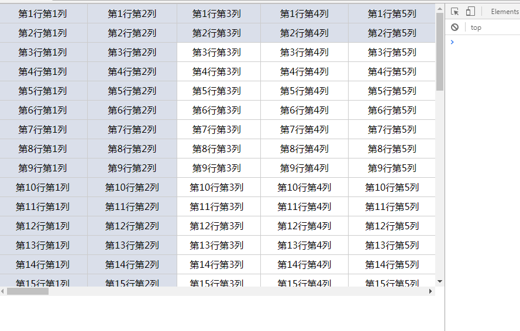

# fixTable

## 简介
按照参数，固定表格头部、左侧(类 excel )，以优化 web 表格展示

## 优点

- 原生 js 编写，无需依赖其他第三方库
- 界面自适应，当界面改变大小的时候，fixTable 自动重新计算宽高度以适应界面
- 提供 resize()方法, 当需重新改变表格布局的场景时使用

## 如何使用

```html
<link rel="stylesheet" type="text/css" href="path-to/fixTable.css">
<script type="text/javascript" src="path-to/fixTable.js"></script>
```
```js
/*
 * 'fix1': fixTable id
 * document.getElementById('tbOrigin1'): 需要固定表格的 js 对象
 * {rows: 2, cols: 2}: 配置对象 
 */
var fix1 = new FixTable('fix1', document.getElementById('tbOrigin1'), {rows:2, cols:2})
```

## 	API

{rows:2, cols: 1, background: 'green url(bgimage.png) repeat'}
rows: 固定表头行数
cols: 固定表格左侧列数
background: 设定固定表格行列 css 背景样式

## 改变布局时如何重置表格

```js
var fixA = new fixTable(id, tableElement, configObj);
fixA.resize()
```
## 立即查看效果

```bash
$ git clone https://github.com/Fea-Sin/fixTable.git
```


## 运行效果
